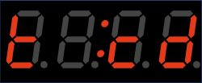
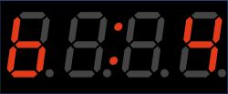

# PedalTimer

A small clock for your guitar pedal board, that counts up or down to measure the duration of songs or to time your performance when you are limited on time.

The github project site: https://github.com/willie68/PedalTimer

For schematic see wokwi project: https://wokwi.com/projects/400030668740998145

For the case see https://www.tinkercad.com/things/1SspvxZFjsm-pedal-timer

# Description

## Introduction 

Pedal Timer is a small clock for your guitar pedal board. It can count up to measure the duration of songs or down to time your performance when you are limited on time. It can be easily configured even with your foot. 

It has a nice Display, showing time and a small multi color LED for showing the state of the Timer.

## Startup

First the unit show up the firmware of your device. (here it's the 0.06 Version)

After 2 Seconds the unit shows the actual mode

t: St means Stopwatch mode, which is the mode for measure times.

If configured in Count down mode, this will show up:

After another 2 seconds, the unit will switch to operating mode.

## Stopwatch mode

Now you are ready to measure times. A short press on the foot switch will start and stop the timer. You can start and stop as often as you like, the unit will always start from the former time. A long press will reset the timer. The time shown in `minutes:seconds`. This will work 'til 99:59, than an overun will happen (timer start again with 00:00) When running the LED will lit up green and the colon in the middle are blinking.

## Countdown Mode

The display always shows the remaining time in countdown mode.

Start/Stop/Reset works the same as in ST mode. When running the LED will lit up green and the colon in the middle are blinking. If the remaining time > 90 min, the display is showing the `hours:minutes`. If you under run the time, this is indicated by an minus in front of the time. 

## Configuration Mode

To start the configuration mode simply press and hold the button on start until you see the menu entry (after showing firmware and mode) , or do a double click, if St or cd is stopped:

for all steps in the configuration: single click means: next value, long press means: next Entry. The unit will always show the last configured value. if you can configure the value the LED will lit up blue. After the long press, the LED will be off and the configured value will be shown for 1 second. Than the display will show the next configuration value. On double click in every configuration you will exit the configuration without saving the actual config value.

### Brightness

First configuration is the display brightness. The value can range from 1..7. You will see the result only in normal operation modes. In configuration the brightness is always set to max. (So you can always see the display for configuration) 

### Operation Mode

  

There are 2 modes of operation: Stopwatch, shown by St and Count down shown by cd.

### Countdown time

Next you can configure the Countdown time in minutes. It ranges from 5 to 240 minutes  in 5 minutes steps. And it rolls over, so after 240 min -> 5 min. Long press stores the value.

### Warning time (Alarm)

You can setup a warning time from 0..15 min. 0 disables the warning. 

- **St mode**: the LED will lit up in RED (instead of green) if the elapsed time is longer than the warning time.

- **cd mode**: the LED will lit up in RED (instead of green) if the remaining time is shorter than the warning time.

# Building our own version

## BOM

What you need:

- arduino nano or compatible
- footswitch spst (single pole single throw) german: einen Fußtaster.
- 4x Digit TM1637 Display with  double point
- a 5mm RGB WS2812b short head LED
- a small SPST switch for manual input by hand
- 3d printed case
- 4 melting nuts M4 and 4 M4x9mm screws
- chicken feed (which means: cables, solder and stuff like that)

for 9V power

- lumberg DC socket
- 9V/5V converter

## Building up

Before you can start, if you have a nano, the display or any other component with pin heads, remove (desolder) them. In the case there is not enough room for that. Than build all up with short cables. Beware of the DC Socket. You have to solder it, after installing the socket. Because this is the only hardware part going from outside to inside. All others can be soldered before. Glue all the other parts into the case with  hot glue. For the RGB LED you can use super glue.  

Than you are ready to program the nano. The project is build with VS Code and Platform.IO. Simply load the project into VS Code and than you can program the nano. Maybe you have to switch the version for your nano. I have build this up with `nanoatmega328new`  but some other nanos where sold with an older boot loader so you have to use `nanoatmega328`. You can switch this in the platformio.ini file.

### building images

Detail view of the power supply

## Schematics

<u>2024 WK-Music</u>